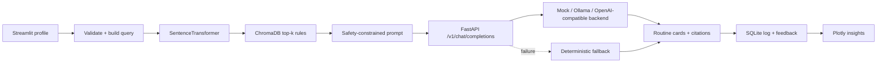

# SkinSense — local-first skincare recommendation with RAG

SkinSense is a cosmetic-only skincare recommendation platform that turns a structured skin profile into a grounded morning and evening routine. It combines local semantic retrieval, constrained generation, transparent rule citations, resilient fallbacks, and a private usage dashboard in one end-to-end AI/ML software project.

> SkinSense is educational and cosmetic only. It does not provide diagnosis, treatment, or medical advice.

## Why this project matters

Recommendation systems are most useful when users can understand where an answer came from and the product remains usable when an AI service fails. SkinSense demonstrates both: every routine starts with retrieved rule cards, exposes their IDs and distances, and can fall back to a deterministic local response.

The project also treats product quality as part of ML engineering. Inputs are validated, response contracts are tested, errors degrade cleanly, interactions are logged locally, and retrieval quality can be checked with fixed queries.

## What I built

- A polished Streamlit routine builder and matching Plotly analytics dashboard.
- A deterministic 89-card cosmetic skincare knowledge base with stable rule IDs.
- SentenceTransformer embeddings and persistent ChromaDB top-k retrieval.
- A safety-constrained prompt with rule-ID citation requirements.
- A configurable OpenAI-compatible client and FastAPI API.
- Mock, Ollama, and OpenAI-compatible proxy backends.
- A deterministic fallback when the language service is unavailable or malformed.
- SQLite interaction logging and Helpful / Not helpful feedback.
- Local-only pytest coverage, GitHub Actions CI, Docker, and Docker Compose.
- A fixed-query RAG evaluation script that prints retrieval evidence.

## Key engineering highlights

- **Grounded responses:** the prompt treats retrieved cards as its only knowledge source.
- **Traceability:** recommendations expose `Rxxx` citations and retrieved distances.
- **Resilience:** missing indexes, invalid top-k values, unavailable endpoints, malformed JSON/Markdown, and database errors have explicit behavior.
- **Local-first defaults:** the FastAPI mock backend requires no API key or paid service.
- **Test isolation:** embedding, vector-store, and HTTP dependencies are mocked in unit tests; SQLite tests use temporary files.
- **Product-quality UI:** calm pastel styling, responsive cards, concise copy, accessible native controls, and subtle source disclosure.

## Architecture



See [docs/architecture.md](docs/architecture.md) for component contracts and failure behavior.

## Project structure

```text
app.py                       Streamlit product and dashboard
assets/styles.css            Pastel visual system
knowledge_base/              Rule generator and checked-in rules
rag/                         Chroma index builder and retrieval
utils/                       Validation, prompts, LLM client, DB, vision
llm_api/main.py              OpenAI-compatible FastAPI service
scripts/bootstrap.py         Knowledge/index readiness bootstrap
scripts/evaluate_rag.py      Fixed-query retrieval quality check
tests/                       Local-only pytest suite
docs/                        Architecture, UI, and sample evidence
.github/workflows/ci.yml     Python 3.11 CI
```

## RAG pipeline

1. Validate skin type, concerns, notes, and retrieval count.
2. Convert the structured profile into a concise natural-language query.
3. Embed it with `all-MiniLM-L6-v2`.
4. Retrieve top-k rules from the persistent `skincare_rules` Chroma collection.
5. Build a prompt that delimits user notes, prohibits diagnosis/treatment, and requires citations.
6. Send the prompt to the local OpenAI-compatible API.
7. Validate response sections and rule citations; use the fallback on failure.
8. Render the routine and source cards, then log the interaction locally.

## Local setup

Python 3.11 is recommended.

```powershell
python -m venv .venv
.\.venv\Scripts\Activate.ps1
python -m pip install --upgrade pip
python -m pip install -r requirements-dev.txt
Copy-Item .env.example .env
Copy-Item llm_api\.env.example llm_api\.env
```

Build the local index only when it does not already exist:

```powershell
python scripts\bootstrap.py
```

Start the mock language service:

```powershell
$env:LLM_BACKEND="mock"
python -m uvicorn llm_api.main:app --host 127.0.0.1 --port 8001
```

In another terminal, start Streamlit:

```powershell
$env:LLM_BASE_URL="http://127.0.0.1:8001"
python -m streamlit run app.py
```

Open `http://localhost:8501`. The mock backend is deterministic and needs no external API key.

## Docker setup

Docker Compose defaults to the local mock backend, so copied environment files are not required for the basic demo:

```powershell
docker compose up --build
```

Services:

- Streamlit: `http://localhost:8501`
- FastAPI health: `http://localhost:8001/health`
- OpenAI-compatible endpoint: `http://localhost:8001/v1/chat/completions`

The existing `logs` and `chroma_db` directories are mounted as local volumes.

## Testing and CI

Run the complete local-only suite:

```powershell
python -m pytest
```

Tests cover:

- Knowledge-base generation and stable IDs.
- Retrieval shape, top-k behavior, invalid inputs, and missing indexes.
- Prompt safety wording and citation rules.
- Fallback and malformed LLM responses.
- SQLite logging and feedback updates.
- FastAPI health and OpenAI-compatible completion shape.

The CI workflow uses Python 3.11, installs `requirements-dev.txt`, and runs pytest. Tests do not call external APIs, require secrets, or download an embedding model.

## RAG quality check

With an existing local index and embedding model, run:

```powershell
python scripts\evaluate_rag.py
```

It evaluates oily acne-prone skin, dry sensitive skin, pigmentation, redness, sunscreen, and beginner-routine queries. For each case it prints rule IDs, distances, tags, and whether an expected tag was found. This is a diagnostic check rather than a benchmark; distance values may vary across library/model versions.

## Sample inputs and outputs

See [docs/sample_inputs_outputs.md](docs/sample_inputs_outputs.md) for representative profiles, output contracts, fallback behavior, and invalid-input behavior.

Example input:

```json
{
  "skin_type": "oily",
  "concerns": ["acne", "texture"],
  "notes": "I prefer a simple beginner routine."
}
```

Every successful response contains:

```text
AM Routine
PM Routine
Extra Tips
Why these suggestions?
Citations: Used: Rxxx, Ryyy
```

## Configuration

Streamlit client:

| Variable | Default | Purpose |
|---|---|---|
| `LLM_BASE_URL` | `http://localhost:8001` | OpenAI-compatible API base |
| `LLM_API_KEY` | `dummy` | Accepted by local mock service |
| `LLM_MODEL` | `skinsense-local` | Logical model name |
| `LLM_TIMEOUT_SECONDS` | `20` | Client HTTP timeout |
| `VISION_ATTR_URL` | unset | Optional local image-attribute service |

FastAPI backend:

| Variable | Default | Purpose |
|---|---|---|
| `LLM_BACKEND` | `mock` | `mock`, `ollama`, or `openai` |
| `OLLAMA_BASE_URL` | `http://localhost:11434` | Optional Ollama service |
| `OLLAMA_MODEL` | request model | Optional Ollama model |
| `OPENAI_BASE_URL` | `https://api.openai.com` | Optional compatible upstream |
| `OPENAI_API_KEY` | unset | Required only for the optional proxy backend |

## Safety and limitations

- The knowledge base is synthetic, small, and educational; it is not clinically validated.
- Retrieval similarity is not a substitute for expert evaluation.
- The fallback is intentionally generic and does not synthesize each rule into tailored prose.
- The optional image integration depends on a separately configured service and is not a diagnostic feature.
- Hosted model behavior can vary; SkinSense validates structure and falls back but cannot guarantee factual quality beyond its rule grounding.
- First-time SentenceTransformer setup can require downloading the public model. Unit tests never require that download.

## Resume-ready project summary

Built a local-first RAG skincare recommendation platform using Streamlit, ChromaDB, SentenceTransformers, FastAPI, and SQLite. Implemented grounded top-k retrieval with rule citations, OpenAI-compatible mock/Ollama/hosted backends, deterministic fallback behavior, input and response validation, analytics and feedback logging, Docker deployment, pytest coverage, CI, and a fixed-query retrieval evaluation harness.

## License

See [LICENSE](LICENSE).
