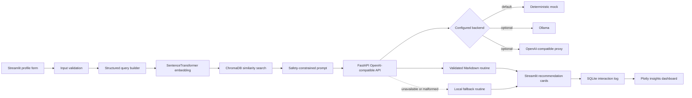

# SkinSense architecture

SkinSense is a local-first retrieval-augmented skincare recommender. The recommendation boundary is intentionally cosmetic and educational: it retrieves curated rule cards, asks an optional language backend to organize them, and records the interaction locally for product analytics.

## Request flow



## Components

| Component | Responsibility | Reliability boundary |
|---|---|---|
| `app.py` | Streamlit experience, state, feedback, and dashboard | Converts failures into concise user-facing states |
| `utils/validation.py` | Skin profile, concern, top-k, and feedback validation | Rejects unsupported values before retrieval or persistence |
| `knowledge_base/` | Deterministic cosmetic-only rule generation | Stable `Rxxx` IDs; checked-in JSON is the source used to build the index |
| `rag/build_index.py` | Validates rules and writes embeddings to Chroma | Rejects malformed and duplicate rule cards |
| `rag/retrieve.py` | Loads the persistent collection and returns top-k cards | Validates `k`, collection readiness, response shape, and distances |
| `utils/prompt_templates.py` | Builds the grounded recommendation prompt | Delimits untrusted notes and requires safety language and rule citations |
| `utils/llm_client.py` | Calls an OpenAI-compatible endpoint | Validates URL, timeout, HTTP status, JSON shape, sections, and citations |
| `llm_api/main.py` | `/health` and `/v1/chat/completions` | Local mock by default; validates optional backend responses |
| `utils/db.py` | SQLite logging, history, aggregates, and feedback | Parameterized SQL, rollback, domain errors, and temporary DBs in tests |
| `scripts/evaluate_rag.py` | Fixed-query retrieval quality check | Prints evidence; never calls an LLM or modifies the index |

## Data contracts

Retrieved rule:

```json
{
  "id": "R001",
  "document": "Cosmetic guidance text",
  "metadata": {"tags": "skin_type:oily concern:acne routine:am"},
  "distance": 0.18
}
```

Logged interaction:

```text
id, UTC timestamp, profile JSON, retrieved rule IDs, response Markdown, feedback
```

The database and Chroma directory are local runtime data and are excluded from Git.

## Failure behavior

- Missing or invalid profile: block generation with a field-level explanation.
- Missing Chroma collection: show the bootstrap command; do not create a silent empty index.
- Empty retrieval: stop before prompting and suggest a broader query or rebuild.
- Unavailable or malformed LLM response: use the deterministic local fallback.
- SQLite failure: keep the generated routine visible and report that history was not saved.
- Invalid feedback or unknown interaction: reject the update without changing another row.

## Safety boundary

The knowledge base, prompt, mock backend, and fallback all use cosmetic-only language. SkinSense does not diagnose, assess severity, recommend prescriptions, or replace qualified professional care. User notes are treated as untrusted profile context rather than instructions.
